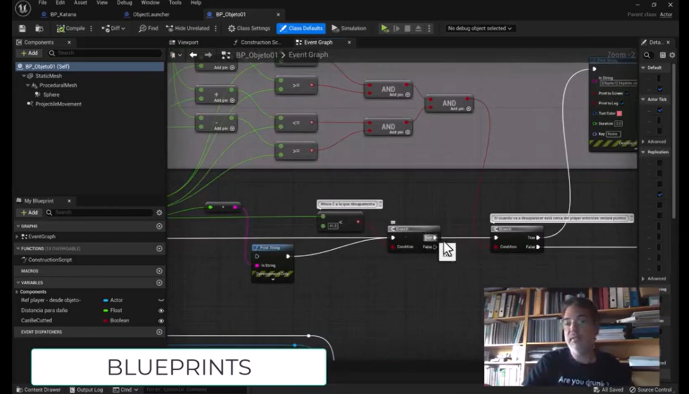
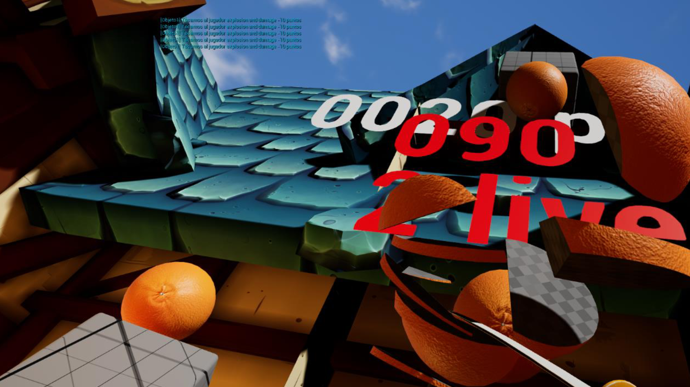
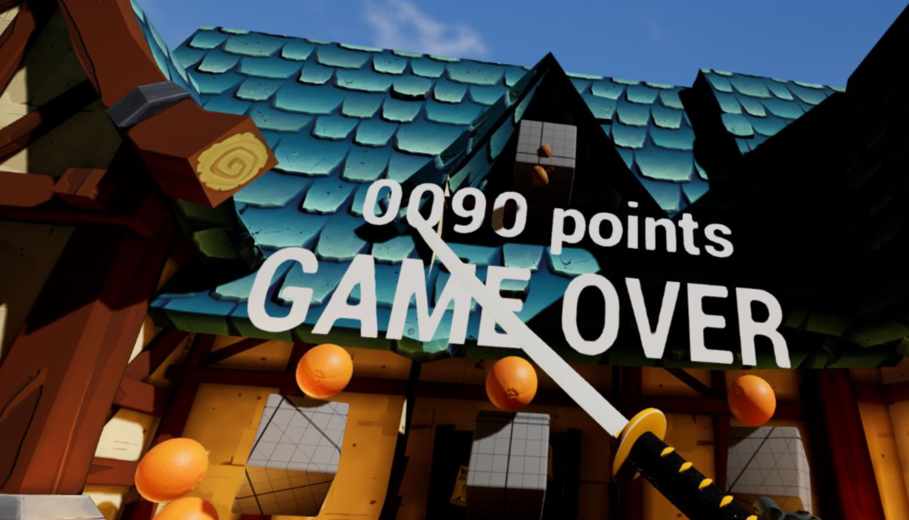
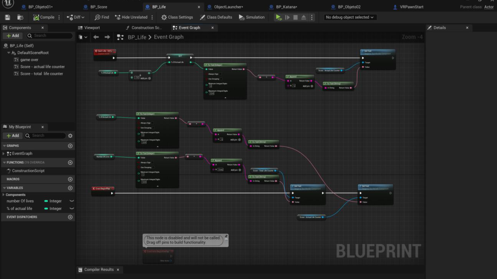
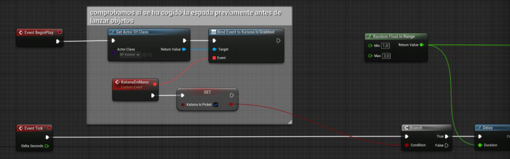
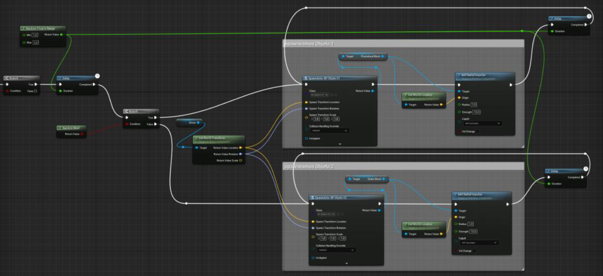
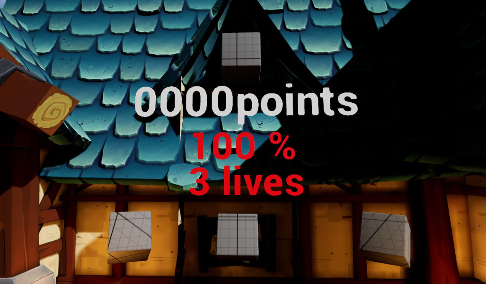

# FruitNinjaVR - Proyecto de Realidad Virtual Avanzada

[](https://www.youtube.com/watch?v=eRLEG0bKT0I)

<div align="center">
<small>- haz click para ver video en youtube -</small>
</div>

## 📋 Descripción del Proyecto

Este es un proyecto de **Unreal Engine 5.1** desarrollado para la asignatura de **Realidad Virtual Avanzada**. El proyecto implementa una experiencia de realidad virtual con múltiples funcionalidades interactivas, incluyendo un sistema de recolección de objetos, mecánicas de juego y un entorno virtual inmersivo.

## 🎮 Características Principales

### Entorno Virtual
- **Fantastic Village Pack**: Entorno de pueblo fantástico con múltiples mapas (día, noche, vista general)
- **Sistema de iluminación dinámica** con soporte para diferentes momentos del día
- **Efectos visuales** (fuego, humo, partículas de viento)


*Vista general del entorno virtual del juego*


*Interacción con objetos en el entorno VR*

### Mecánicas de Juego
- **Sistema de recolección de objetos**: Plátanos, naranjas, granadas
- **Sistema de puntuación** con efectos de sonido retro
- **Sistema de vidas** para el jugador
- **Arma katana** con mecánicas de combate
- **Lanzador de objetos** para interacción dinámica


*Sistema de vidas implementado con Blueprint*


*Lanzador de objetos - Vista 1*


*Lanzador de objetos - Vista 2*

### Audio y Efectos
- **Biblioteca de sonidos retro** (mixkit)
- **Efectos de sonido de combate** y recolección
- **Música de fondo** para diferentes situaciones de juego
- **Efectos de audio espacial** con Resonance Audio


*Interfaz de usuario del juego VR*

## 🛠️ Tecnologías Utilizadas

- **Unreal Engine 5.1**
- **OpenXR** para compatibilidad con dispositivos VR
- **Resonance Audio** para audio espacial
- **Blueprint Visual Scripting**
- **C++** para funcionalidades avanzadas

## 📁 Estructura del Proyecto

```
Content/
├── 3dModels/           # Modelos 3D (Banana, Grenade, Orange)
├── Audio/             # Efectos de sonido y música
├── Blueprint/         # Blueprints del juego
├── Characters/        # Personajes VR (MannequinsXR)
├── Fantastic_Village_Pack/  # Entorno principal
├── FPWeapon/          # Sistema de armas
├── VRSpectator/       # Modo espectador VR
└── VRTemplate/        # Plantilla base VR
```

## 🎯 Objetos Interactivos

### Objetos Recolectables
- **BP_Banana**: Plátano con sistema de recolección
- **BP_Orange**: Naranja con mecánicas similares
- **BP_Score**: Objetos de puntuación
- **BP_Life**: Objetos de vida extra

### Armas y Herramientas
- **BP_Katana**: Espada con sistema de combate
- **ObjectLauncher**: Sistema de lanzamiento de objetos

## 🎮 Controles VR

El proyecto incluye configuraciones específicas para:
- **Oculus Quest/Quest 2**
- **OpenXR** para compatibilidad multiplataforma
- **Seguimiento de manos** y controladores
- **Haptics** para retroalimentación táctil

## 🚀 Instalación y Configuración

### Requisitos del Sistema
- **Unreal Engine 5.1** o superior
- **Dispositivo VR compatible** (Oculus, HTC Vive, etc.)
- **Windows 10/11** (recomendado)

### Pasos de Instalación
1. Clonar o descargar el proyecto
2. Abrir `FruitNinjaVR.uproject` con Unreal Engine 5.1
3. Compilar el proyecto si es necesario
4. Configurar el dispositivo VR
5. Ejecutar el proyecto

### Configuración VR
- Asegúrate de que **OpenXR** esté habilitado
- Configura **Resonance Audio** para audio espacial
- Verifica la configuración de **Oculus** en las configuraciones del proyecto

## 🎨 Assets Incluidos

### Modelos 3D
- **Banana**: Modelo de plátano con texturas PBR
- **Grenade**: Granada con materiales detallados
- **Orange**: Naranja con sistema de materiales
- **Katana**: Espada japonesa con texturas 2K

### Audio
- **Efectos de combate**: Sonidos de impacto y combate
- **Música retro**: Pistas de fondo estilo arcade
- **Efectos de recolección**: Sonidos de recogida de objetos
- **Efectos ambientales**: Audio espacial para inmersión

## 🔧 Configuración del Proyecto

### Plugins Habilitados
- **OpenXR**: Para compatibilidad VR multiplataforma
- **Resonance Audio**: Para audio espacial 3D

### Configuraciones Específicas
- **Targeting**: Móvil/VR optimizado
- **Rendering**: Configurado para VR (instanced stereo)
- **Audio**: Spatial audio habilitado

## 📊 Rendimiento

El proyecto está optimizado para:
- **Dispositivos VR móviles** (Quest, Quest 2)
- **Rendering eficiente** con instanced stereo
- **Audio espacial** optimizado
- **Texturas comprimidas** para mejor rendimiento

## 🎓 Propósito Educativo

Este proyecto demuestra:
- **Integración de VR** en Unreal Engine
- **Sistemas de interacción** en realidad virtual
- **Audio espacial** para inmersión
- **Optimización** para dispositivos VR
- **Blueprint scripting** para mecánicas de juego

## 🎯 Objetivos del Proyecto

Este proyecto tiene como objetivo principal demostrar las capacidades de desarrollo de aplicaciones de realidad virtual utilizando Unreal Engine 5.1, implementando:

- **Interacciones inmersivas** con objetos del entorno virtual
- **Sistemas de recolección** y mecánicas de juego adaptadas a VR
- **Audio espacial** para mayor inmersión del usuario
- **Optimización de rendimiento** para dispositivos VR móviles
- **Integración de tecnologías VR** modernas (OpenXR, Resonance Audio)

## 🔬 Aspectos Técnicos Implementados

### Sistemas de Interacción VR
- **Seguimiento de manos** y controladores VR
- **Física realista** para objetos interactivos
- **Sistemas de colisión** optimizados para VR
- **Haptics** para retroalimentación táctil

### Optimizaciones VR
- **Instanced Stereo Rendering** para mejor rendimiento
- **Foveated Rendering** (configurable)
- **LOD (Level of Detail)** dinámico
- **Culling** optimizado para entornos VR

### Audio Espacial
- **Resonance Audio** para audio 3D
- **Occlusión** y reverberación espacial
- **Efectos de sonido** contextuales
- **Música adaptativa** según el estado del juego

## 📊 Métricas de Rendimiento

- **FPS objetivo**: 90 FPS (Quest 2)
- **Latencia de tracking**: < 20ms
- **Resolución**: 1832x1920 por ojo
- **Campo de visión**: 90° horizontal

## 🎓 Competencias Desarrolladas

- **Programación en Blueprint** para mecánicas de juego
- **Integración de assets** 3D y audio
- **Optimización de rendimiento** para VR
- **Diseño de UX/UI** para entornos inmersivos
- **Testing y debugging** en dispositivos VR

## 👨‍💻 Desarrollador

**Carlos Lorente Baeza** - Trabajo individual para Realidad Virtual Avanzada

*Universidad: UTAD - Segundo Semestre*

## 📝 Notas Adicionales

- El proyecto incluye múltiples mapas de prueba
- Sistema de autoguardado implementado
- Logs de depuración disponibles en `Saved/Logs/`
- Screenshots automáticos en `Saved/Screenshots/`

---

*Proyecto desarrollado con Unreal Engine 5.1 para la asignatura de Realidad Virtual Avanzada*
